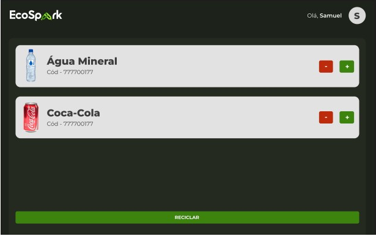
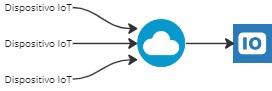
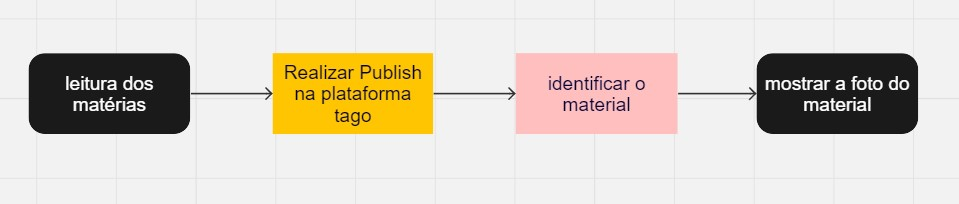

# Sprint 4 - lixeira inteligente

**Nome dos participantes:**

- Guilherme Silva Dos Santos
- Kayque Moraes Dias
- Laís Granero Bertoncello
- Wesley de Souza Silva
- Samuel Ramos de Almeida

**Turma:** 1º ESPX

**Ano:** 2023
___

## 1º Ecospark - Inovação Sustentável com a IoT 

A IoT (Internet das Coisas) revolucionou a maneira como interagimos com o mundo, proporcionando comodidade e eficiência sem precedentes. Desde o controle remoto do termostato de nossa casa via smartphone até o rastreamento em tempo real do lixo reciclável nas cidades inteligentes, essa tecnologia beneficia não apenas o planeta, mas também as empresas.

As lixeiras podem monitorar automaticamente seu nível de enchimento, além de rastrear os materiais contidos dentro delas, graças aos sensores embutidos. Essa inovação permite um gerenciamento eficiente da coleta de lixo, reduzindo a frequência de caminhões de lixo nas ruas e, consequentemente, economizando recursos. Além disso, a capacidade de monitorar os tipos de materiais facilita a triagem e reciclagem adequada, contribuindo ainda mais para a sustentabilidade ambiental.

A IoT não apenas transforma a gestão de resíduos, mas também serve como a espinha dorsal das cidades inteligentes. Ela impulsiona a eficiência de serviços públicos, transporte, sustentabilidade e muito mais, tornando os ambientes urbanos mais habitáveis e sustentáveis.

No nosso projeto, desenvolvemos uma lixeira inteligente que se conecta a uma rede, fornecendo informações valiosas sobre o conteúdo de cada uma delas e o espaço disponível. Além disso, nossa solução oferece uma estimativa precisa de quanto tempo falta para que cada lixeira atinja sua capacidade máxima. Isso é possível graças à tecnologia de sensores e conectividade IoT (Internet das Coisas).

Concluindo, a IoT está mudando radicalmente nossa forma de viver, trabalhar e interagir com o ambiente. Sua importância é inegável, moldando um futuro mais conectado, eficiente e inovador em todos os aspectos da nossa sociedade. À medida que continuamos a explorar seu potencial, a IoT promete um mundo cada vez mais inteligente e interconectado.
___

## Desenvolvimento do projeto

Para concretizar este projeto, utilizamos uma plataforma de Internet das Coisas (IoT) para transmitir os dados coletados pela lixeira inteligente, incluindo informações detalhadas sobre os materiais que foram recolhidos. Empregamos o MQTT para estabelecer uma conexão segura com o serviço tago.io, através do qual enviamos os dados coletados pela lixeira.

Posteriormente, realizamos o processamento desses dados utilizando a API fornecida pelo tago.io. Os dados processados são então encaminhados para o nosso site da EcoSpark, onde serão apresentadas as informações sobre os materiais que estão atualmente presentes na lixeira inteligente.

Em relação ao hardware utilizado para identificar os produtos e materiais na lixeira, utilizamos um ESP32 equipado com placa de rede Wi-Fi, desempenhando um papel crucial na comunicação com a internet. Adicionalmente, implementamos um leitor de códigos de barras e QR codes para fazer a leitura e transmitir a sequência de códigos através do protocolo MQTT. Para fins de demonstração e simulação, adaptamos o projeto para funcionar na plataforma Wokwi.

Por fim, os codigos de barra enviados para plataforma tago exibe os materiais que foram inseridos na lixeira inteligente.

Essa combinação de hardware e plataforma IoT nos permitiu criar um sistema altamente eficiente para monitorar e registrar os materiais presentes na lixeira, contribuindo significativamente para a gestão inteligente de resíduos em nossas lixeiras e promovendo práticas mais sustentáveis.

___
   
## Pré-requisitos

Para utilizar este projeto, você precisará de:

   #### HARDWARE  

   - ESP32
   - Cabo de dados e carga - Micro USB
   - Protoboard 830 Pontos
   - 12 jumpers
   - resistor 220ohm

   #### SOFTWARE 

   - Arduino IDE

   
___
## Como executar o projeto

Após a instalação do Arduíno IDE, você deve seguir os seguintes passos:

1. Faça download do código da pasta "Código Fonte" deste repositório.
2. Abra o código no Arduino IDE.
4. Faça o download da biblioteca ESP32
3. Conecte os sensores e componentes de acordo com as instruções fornecidas no código.

____

## Modelo lógico  

## Video Explicativo
Link do vídeo: https://drive.google.com/file/d/1pXogVYvRCg-PfRZCtWrTS9oVeE_-VQWw/view?usp=sharing

